# Objective bitrate evaluation

The data found by [subjective evaluation](bitrate-evaluation.md) is just a starting point.
It's working with very limited data. The goal here is to be able to answer a question where we're given:

- Resolution
- Viewing distance
- Chroma 4:4:4 or not
- Target quality

What is the bitrate required? Viewing distance in particular is very important to
have in the equation since this dramatically affects required bitrate for target
perceived quality, especially with PyroWave. PyroWave intentionally takes advantage
of this effect to keep bitrates somewhat reasonable despite being a very low-complexity intra-only codec.

## PSNR-HVS-M metric and its modification

I'm not aware of any objective metrics which easily let us plug in viewing distance,
so I had to make one myself. I adapted the [PSNR-HVS-M metric](https://www.ponomarenko.info/psnrhvsm.htm).

The core idea of PSNR-HVS is that errors are computed, and the 8x8 DCT is taken of that error to get
a frequency distribution. The errors are weighted against a contrast sensitivity function (CSF)
which estimates how humans perceive detail. Higher spatial frequencies (in cycles-per-degree, CPD) are less sensitive.
The CSF peaks around 8 CPD, and decays after.

PSNR-HVS-M refines the original by adding "masking", which was shown to correlate much better with subjective results than previous metrics (at the time, it's probably not state of the art in 2026).
From what I understand, this roughly mirrors how audio compression uses "masking" where strong frequency components mask weak errors in
other frequency components.

I implemented a [compute shader](../shaders/psnr_hvs_m.comp) which implements the algorithm
on the GPU and runs more than fast enough for my needs.
I confirmed that it generates the same results as the provided Matlab code.

The PSNR-HVS-M algorithm seems to have basically cribbed the JPEG quantization matrix and used the inverse of that
as the CSF, which seems a bit dodgy and only assumes a fixed distance to the screen, but is likely fine as a default metric.
I modified the implementation to plug in a custom CSF which is computed based on the "H"-factor to the screen and number of vertical pixels.
The "H" factor is defined as the distance to screen divided by height of active video area.
The ranges of H I'm interested in here is 1.0 (very close to monitor, filling almost the entire view), to about 3 (couch gaming on a modestly sized screen).
My subjective results were made with H = 2 for reference.
This modified CSF approach I informally dubbed PSNR-HVS-M-H, H standing for taking "H" into account.

Only luminance error is computed. PSNR-HVS-M does not define error metric for chroma.
At same luminance error, we expect 4:4:4 to yield a better looking image,
but there is no way to quantify that in this framework.

## Test clips

I took some challenging lossless 4K 4:4:4 clips from:

- Horizon Zero Dawn Remastered
- Expedition 33
- Witcher 3
- Street Fighter 6

which should push any codec hard.

```
$ pyrowave-psnr-hvs-m \
        --csv eval-results/psnr-sweep-output-2.csv \
        --reference sf6-drop.mkv \
        --reference w3-drop.mkv \
        --reference e33-drop.mkv \
        --reference hzd-drop.mkv \
        --scale-size-sweep \
        --pyrowave-target-size-range 50000 5000000 25000
```

**NOTE: Only 16:9 aspect ratio has been tested.
It's expected that ultra-wide 21:9 or super ultra-wide 32:9 would need separate analysis.**

Then, a massive combination of parameters are explored:

- "Every" 16:9 resolution from 720p to 4K are tested.
- 4:2:0 and 4:4:4.
- 16 different viewing distances.
- Every plausible bitrate is tested. From complete garbage bitrates to ridiculous multi-gigabit configurations.

The final score for a given parameter combination is the normal dB computation of `10 * log10(MaxRange * MaxRange / AveragePSNR_HVS_M_H_SquaredErrorOverAllFrames)`.

The sources are rescaled with a high-quality sinc scaler to the test resolution in question.
It's the same shader-based scaler I use for pyrofling.
This has the effect of making lower resolution raw footage look "better" than it might normally do,
since this is basically rendering games with supersampling.
I think this represents a real world scenario though since at least I tend to render games at a high resolution on my desktop PC
and downsample a super clean image for target display.
It is impractical to capture game footage for every possible resolution since:

- No way to guarantee exact same scene is used unless a highly controlled benchmark setup is used.
- Temporal upscalers will dramatically change the overall quality of visuals depending on resolution.

One frame takes 10s of second to process due to the ridiculous combinatorics involved, so ~10 representative frames were taken per game to keep the runtime reasonable.
Once this is processed, a massive .csv file is generated (see [psnr-sweep-output-2.csv](psnr-sweep-output-2.csv)).

## Regressing out some curves

Once all the raw data was in place, I hacked together a Python [script](regress.py) that find parametric formulas to solve for bitrate given the parameters:

- Resolution
- Viewing distance
- Chroma 4:4:4 or not
- Target quality

Using linear regression of a 7th order polynomial to brute force the results,
I generate a lookup-table of polynomial coefficients that estimate the curves within about 1% accuracy.
I attempted a multi-dimensional regression, but I couldn't make that work well in the limited amount of time I wanted to spend on this.
I chose the simple solution of generating many single 1D functions instead. The [regress.py](regress.py) script
spits out a C header implementation in [pyrowave_regression_results.h](pyrowave_regression_results.h)
which can be included in an application.

## Example output curves

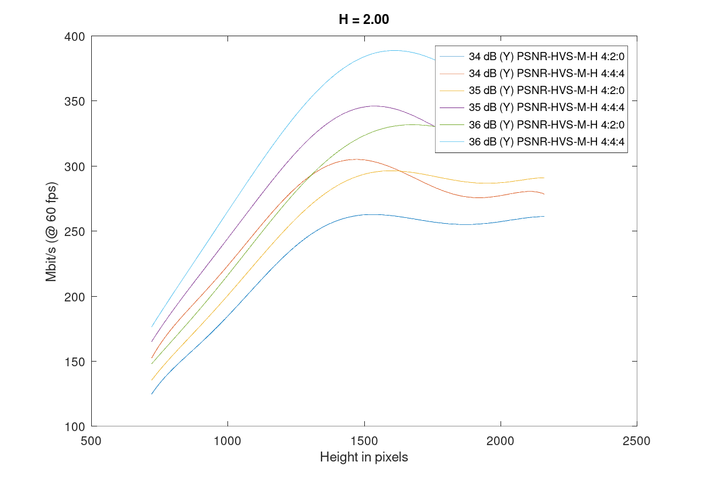

With the test clips I used, I found that ~35 dB PSNR-HVS-M-H curve tracks well with my default good quality curve.
At H = 2.0, the objective numbers agree with my subjective assessment that the bitrate curve
for 720p to 4K is about 125 mbit to 300 mbit. However, bitrate requirements start falling off
around 1440p. The idea here is that adding more pixels to 1440p at 2H viewing distance will shift the CSF further down
the slope, meaning that some sort of equilibrium is hit and caps out at about 300 mbit.
My original subjective measurement curve missed this effect entirely, due to lack of data.
The 1440p results were obtained on my worst quality display, which could explain a few extra things ...

PyroWave (and wavelet codecs in general) like throwing away high frequency detail when it can,
and a 1080p bitstream is implicitly also a (blurry) 4K bitstream too, so these results are not surprising to me.

We also see that there is about a 15%-20% penalty for 4:4:4 to reach same luminance quality,
which is roughly what my subjective testing suggested.
In practice, some luminance quality can probably be sacrified in order to gain much improved chroma, but the
objective measurement I'm using here cannot discover that.

On the more extreme end of H = 1 (sitting uncomfortably close to the screen), the bitrate requirements
explode at higher resolution, as expected. The required bitrates scale sub-linearly with pixel counts, but there is no higher cap
since going from 1440p to 4K is an obvious improvement at such close viewing distances.
This is a configuration that PyroWave was never quite designed for, but if you throw enough bits at the problem ...

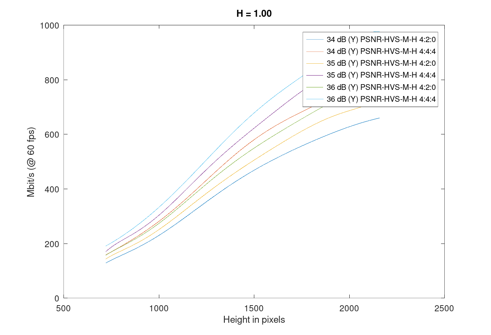

At a close, but not uncomfortably close distance of H = 1.5, the rates start capping out at ~1800p.

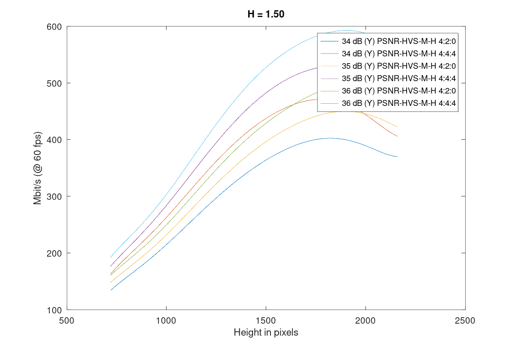

At a longer distance, the rates start falling off rather quickly as expected.

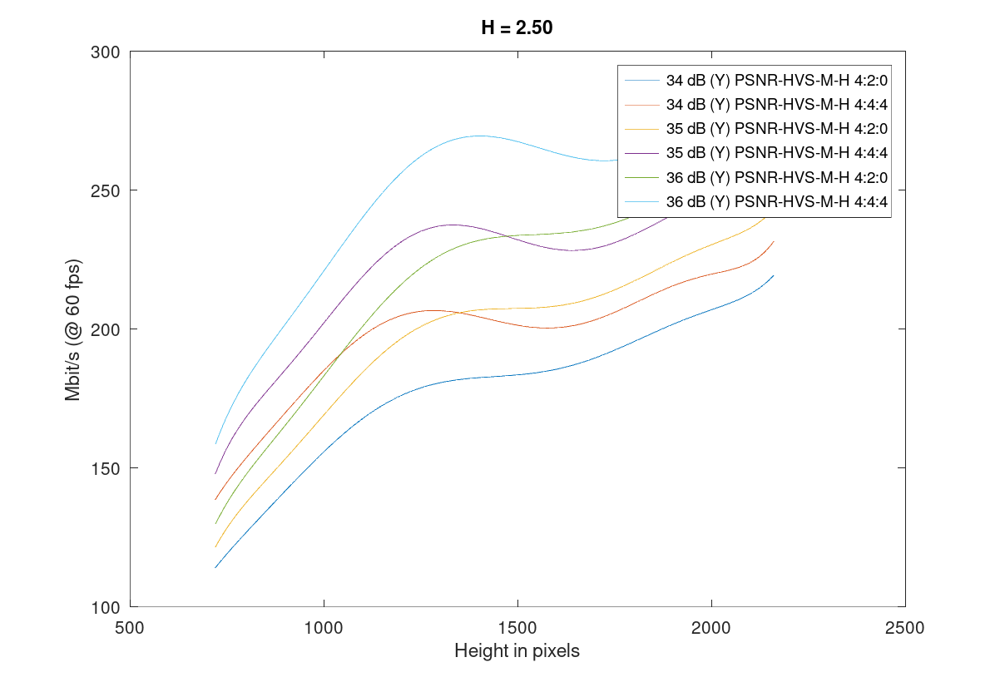

### More curves

See [pyrowave_eval_sandbox.c](pyrowave_eval_sandbox.c) for examples on how the Octave curves are generated
with some really ugly hacked up code. :D

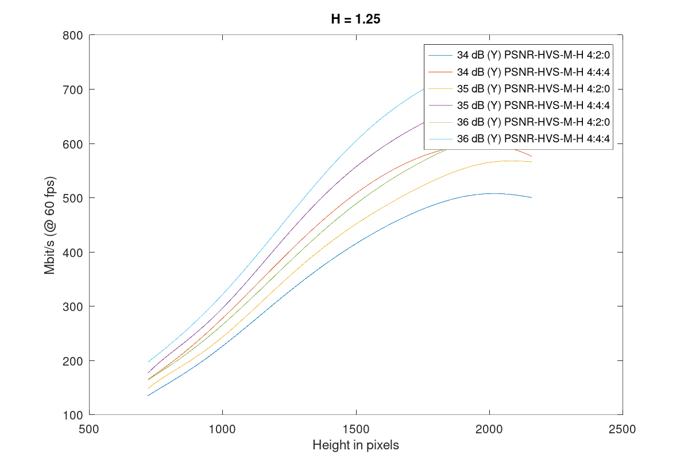
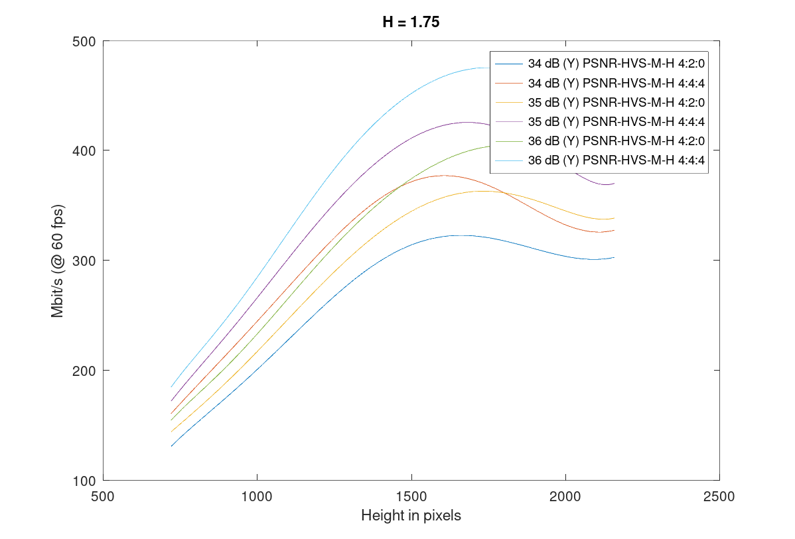
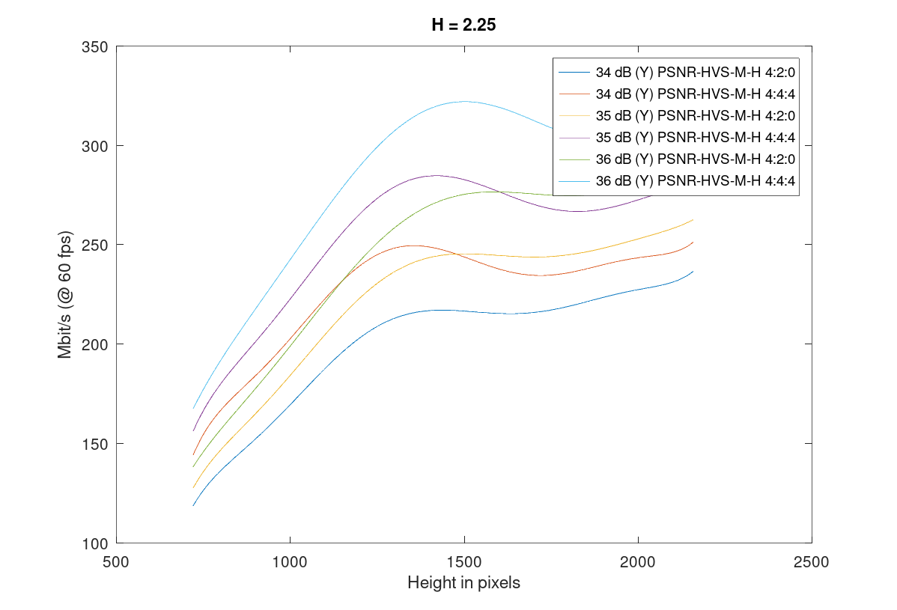
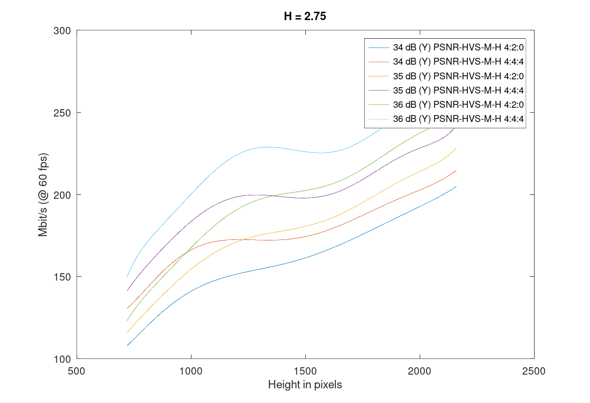

### Rough comparison with HEVC

To get a basic idea how HEVC quality metrics match.
This is running through pyroenc with intra refresh enabled and low-latency engaged on RX 9070 XT.
This is the same mode I would use to stream HEVC for example.
Motion prediction is a super power for compression that intra-only codecs don't take advantage of,
so the massive differences in compression is completely expected.
The scaling factors are not as extreme as I would normally expect though.

I tested this known difficult scene from Witcher 3:

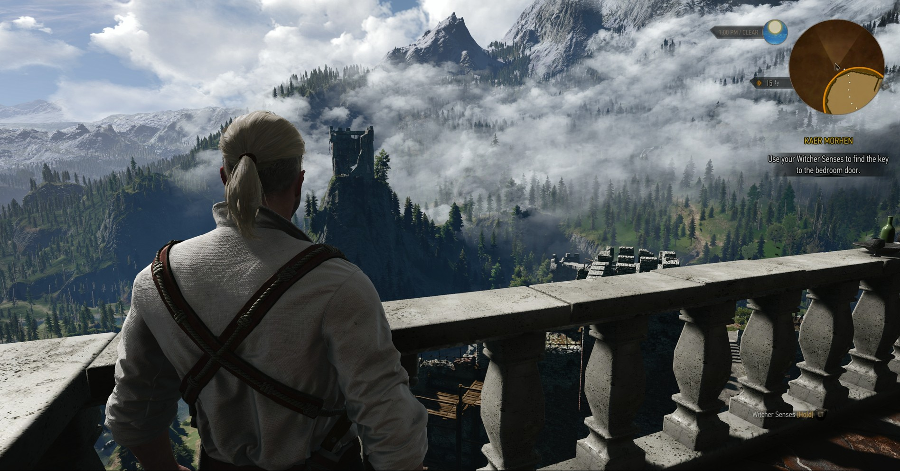

This is actually one of the easier clips to code in the test suite it turns out ... :v

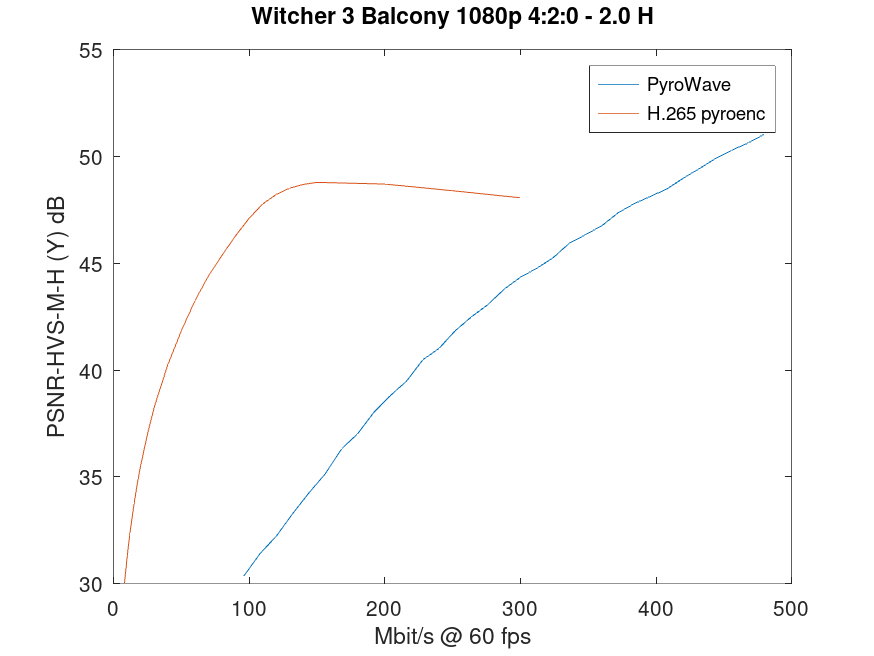

Somehow, the HEVC encoder just completely caps out this metric around 48 dB, but that's way beyond visually lossless,
so not particularly interesting. Driving the HW encoder at those rates for 1080p is just silly.

The quality metric does not take cross-frame effects into account,
e.g. the intra-refresh crawling effect is not observed in the numbers despite being quite jarring at lower bitrates like 20-30 mbit.
Another thing to point out that the motion complexity in this clip is intentionally very low, far lower than natural gameplay would imply,
so that likely biases results heavily in favor of motion prediction.

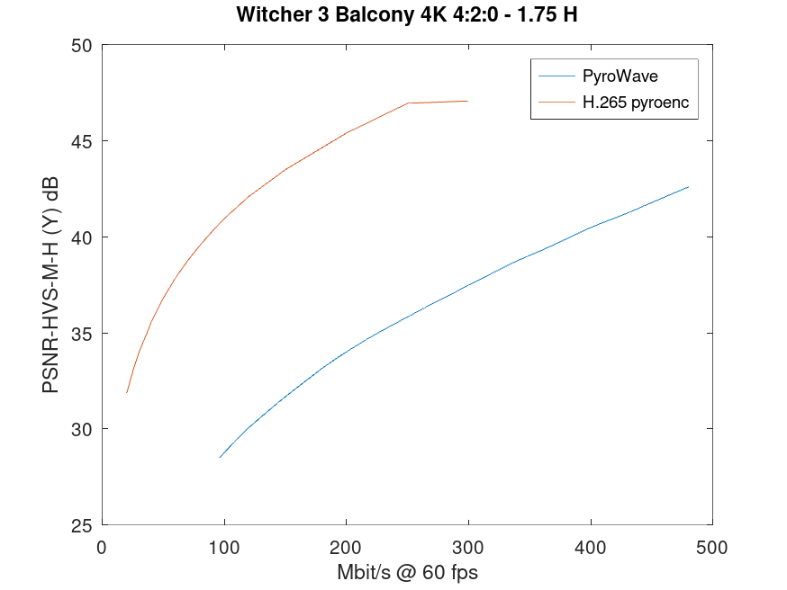